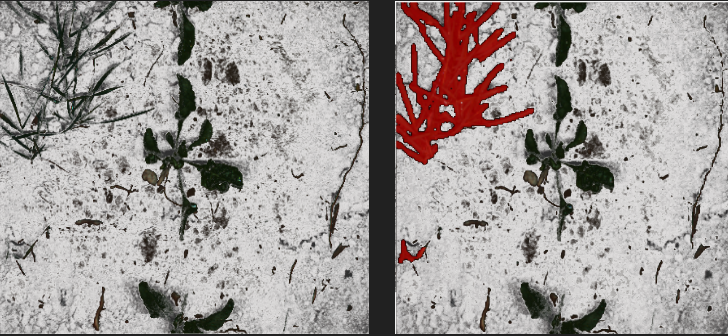
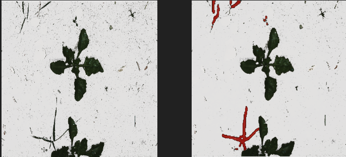
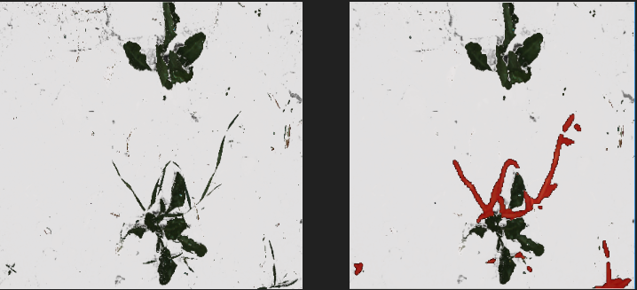
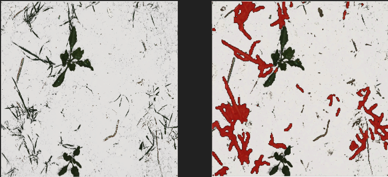
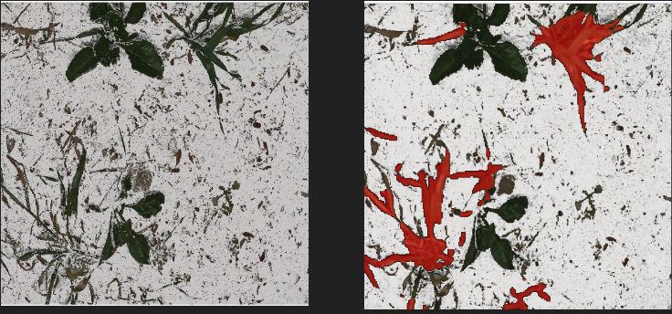
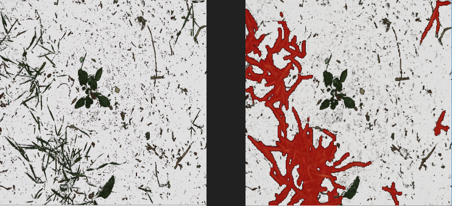

## 
Weed Segmentaion 

Weed Segmentaion system based on U-Net deep learning architecture implemented with Keras  

* Dataset: [Dataset:Sugar Beets 2016]( http://www.ipb.unibonn.de/data/sugabeets2016/)
* Model implemented in Keras
* Flask model serving in Docker container
* WPF Client 

### 
Screenshots

Black color of ground was manually replaced by white

